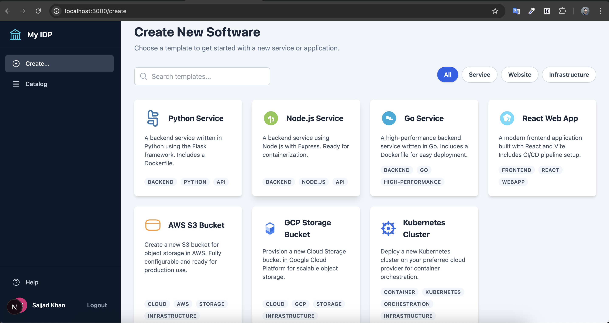
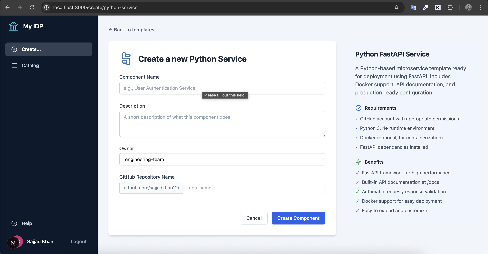
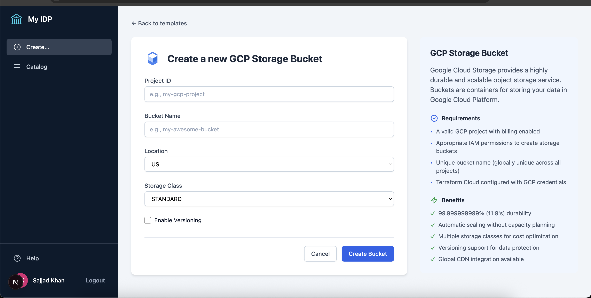
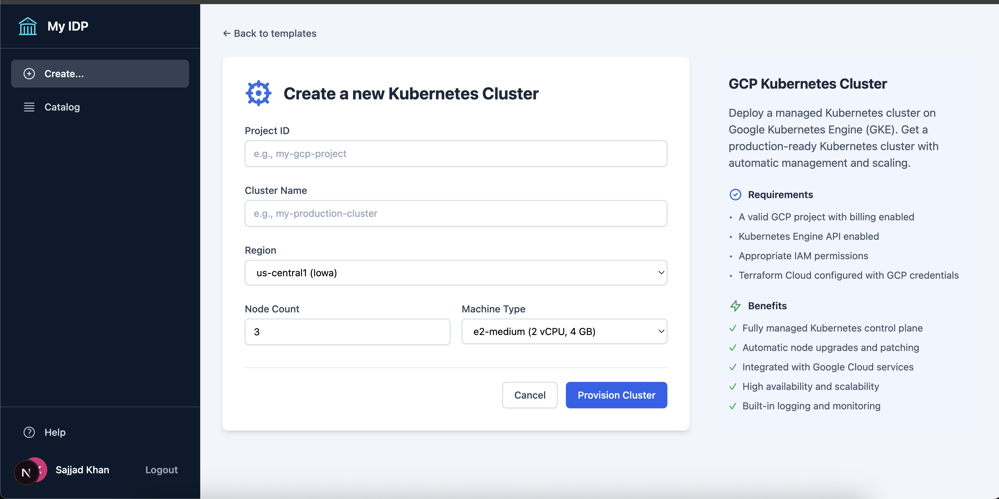

# Personal IDP Dashboard

A self-service Internal Developer Platform (IDP) dashboard that enables teams to provision infrastructure and software components with ease. Built with Next.js, Express.js, PostgreSQL, and integrated with Terraform Cloud and GitHub.



## 📋 Table of Contents

- [Overview](#overview)
- [Features](#features)
- [Architecture](#architecture)
- [Services](#services)
- [Requirements](#requirements)
- [Setup Instructions](#setup-instructions)
- [Configuration](#configuration)
- [Usage Guide](#usage-guide)
- [Troubleshooting](#troubleshooting)
- [Contributing](#contributing)

## 🎯 Overview

The Personal IDP Dashboard is a comprehensive platform that allows developers to:

- **Create Microservices**: Generate Python FastAPI services with GitHub repository creation
- **Provision Infrastructure**: Deploy GCP resources like storage buckets and Kubernetes clusters
- **Manage Components**: Track, monitor, and destroy infrastructure from a unified dashboard
- **Template-Based Creation**: Use pre-configured templates for rapid service deployment

## ✨ Features

### Service Management
- 🚀 **Template-Based Service Creation**: Select from pre-configured templates for different service types
- 📦 **Python FastAPI Services**: Generate production-ready Python microservices with GitHub integration
- 🔄 **GitHub Repository Management**: Automatic creation and deletion of GitHub repositories
- 📊 **Status Monitoring**: Real-time tracking of component provisioning and destruction

### Infrastructure Provisioning
- ☁️ **GCP Storage Buckets**: Create and manage Google Cloud Storage buckets
- 🎯 **GCP Kubernetes Clusters**: Deploy managed GKE clusters
- 🏗️ **Terraform Integration**: Automated infrastructure provisioning via Terraform Cloud
- 🔧 **Workspace Management**: Automatic Terraform workspace creation and cleanup

### User Experience
- 🎨 **Modern UI**: Clean, responsive interface built with Next.js and Tailwind CSS
- 🔐 **GitHub OAuth**: Secure authentication using GitHub
- 📱 **Real-Time Updates**: Live status updates for all operations
- 🗑️ **One-Click Destroy**: Easy infrastructure cleanup
- ❌ **Error Handling**: Comprehensive error reporting with retry capabilities

## 🏗️ Architecture

### Tech Stack

**Frontend:**
- Next.js 12+ (React framework)
- TypeScript for type safety
- Tailwind CSS for styling
- Axios for API calls

**Backend:**
- Node.js with Express.js
- PostgreSQL database
- Terraform Cloud API integration
- GitHub API integration

**Infrastructure:**
- Terraform Cloud for IaC
- GitHub for source control and templates
- Google Cloud Platform for cloud resources

### System Flow

```
┌─────────────┐       ┌──────────────┐       ┌─────────────────┐
│   User      │──────▶│   Frontend   │──────▶│    Backend      │
│  (Browser)  │       │  (Next.js)   │       │  (Express.js)   │
└─────────────┘       └──────────────┘       └─────────────────┘
                                                 │         │
                                                 ▼         ▼
                                         ┌──────────┐  ┌──────────┐
                                         │   PG     │  │ Terraform│
                                         │ Database │  │  Cloud   │
                                         └──────────┘  └──────────┘
                                                              │
                                                              ▼
                                                         ┌─────────┐
                                                         │   GCP   │
                                                         └─────────┘
```

## 🛠️ Services

### Currently Available Services

#### 1. **Python FastAPI Service** 🐍
Generate a complete Python microservice with FastAPI framework.

**What You Get:**
- FastAPI application with "Hello World" endpoint
- Complete `requirements.txt` with all dependencies
- Production-ready `Dockerfile`
- `.gitignore` and `.dockerignore`
- Comprehensive README

**Template Location:** `https://github.com/sajjadkhan-academy/idp-templates/tree/main/python-service`

**Output:**
- New GitHub repository with complete service code
- Ready to deploy to any container platform

#### 2. **GCP Storage Bucket** ☁️
Create a Google Cloud Storage bucket for object storage.

**Configuration:**
- Project ID (GCP project)
- Bucket name (globally unique)
- Location (US, EU, ASIA)
- Storage class (STANDARD, NEARLINE, COLDLINE, ARCHIVE)
- Versioning (optional)

**Features:**
- Terraform-managed infrastructure
- Automatic lifecycle policies
- Versioning support
- High durability (99.999999999%)

#### 3. **GCP Kubernetes Cluster** 🎯
Provision a managed Google Kubernetes Engine (GKE) cluster.

**Configuration:**
- Project ID (GCP project)
- Cluster name
- Region (us-central1, us-east1, europe-west1, etc.)
- Node count (default: 3)
- Machine type (e2-small, e2-medium, e2-standard-2, etc.)

**Features:**
- Fully managed control plane
- Auto-scaling and auto-repair
- Integrated with GCP services
- Built-in logging and monitoring

### Coming Soon
- Node.js Service
- Go Service
- React Web App
- AWS S3 Bucket
- AWS EC2 Instance

## 📋 Requirements

### Software Requirements

**Development Environment:**
- Node.js 16+ and npm
- PostgreSQL 12+
- Git

**Cloud Services:**
- GitHub account with OAuth app
- Google Cloud Platform account with billing enabled
- Terraform Cloud account and organization

**Credentials & Tokens:**
- GitHub Personal Access Token (with `repo` and `write:org` scopes)
- Terraform Cloud API token
- GCP service account credentials (configured in Terraform Cloud)

### Minimum Access Requirements

**GitHub:**
- Ability to create repositories
- OAuth app with appropriate scopes

**Terraform Cloud:**
- Organization admin or workspace admin access
- VCS provider configured

**GCP:**
- Kubernetes Engine API enabled
- Storage API enabled
- Billing enabled on project
- Appropriate IAM permissions

## 🚀 Setup Instructions

### 1. Clone the Repository

```bash
git clone https://github.com/your-username/personal-idp-dashboard.git
cd personal-idp-dashboard
```

### 2. Backend Setup

```bash
cd backend

# Install dependencies
npm install

# Copy environment variables
cp .env.example .env

# Edit .env with your credentials
nano .env
```

**Required `.env` variables:**
```env
# Database
POSTGRES_HOST=localhost
POSTGRES_PORT=5432
POSTGRES_DB=idp_dashboard
POSTGRES_USER=your_username
POSTGRES_PASSWORD=your_password

# GitHub OAuth
GITHUB_CLIENT_ID=your_client_id
GITHUB_CLIENT_SECRET=your_client_secret

# GitHub API
GITHUB_PERSONAL_TOKEN=ghp_your_token
GITHUB_ORG_NAME=sajjadkhan-academy

# Terraform Cloud
TERRAFORM_CLOUD_API_TOKEN=your_tf_cloud_token
TERRAFORM_CLOUD_ORG_NAME=your_org_name
TERRAFORM_CLOUD_REPO=sajjadkhan-academy/terraform-for-idp
TERRAFORM_CLOUD_BRANCH=main

# Template Repository
TEMPLATE_REPO_OWNER=sajjadkhan-academy
TEMPLATE_REPO_NAME=idp-templates
TEMPLATE_BRANCH=main

# Server
PORT=4000
SESSION_SECRET=your_random_secret
```

### 3. Database Setup

```bash
# Create PostgreSQL database
createdb idp_dashboard

# Or using psql
psql -c "CREATE DATABASE idp_dashboard;"

# Start backend (this will create tables automatically)
cd backend
npm start
```

### 4. Frontend Setup

```bash
cd frontend

# Install dependencies
npm install

# Create .env.local for GitHub org name
echo "NEXT_PUBLIC_GITHUB_ORG_NAME=sajjadkhan-academy" > .env.local

# Start development server
npm run dev
```

### 5. Access the Application

- Frontend: http://localhost:3000
- Backend API: http://localhost:4000

## ⚙️ Configuration

### Terraform Repository Setup

Your Terraform configurations should be in: `https://github.com/sajjadkhan-academy/terraform-for-idp`

**Required Directory Structure:**
```
terraform-for-idp/
├── modules/
│   ├── gcp-k8s/
│   │   └── main.tf
│   └── gcp-bucket/
│       └── main.tf
├── terraform-configs/
│   ├── gcp-k8s/
│   │   └── main.tf
│   └── gcp-bucket/
│       └── main.tf
└── README.md
```

### Template Repository Setup

Your service templates should be in: `https://github.com/sajjadkhan-academy/idp-templates`

**Required Directory Structure:**
```
idp-templates/
├── python-service/
│   ├── main.py
│   ├── requirements.txt
│   ├── Dockerfile
│   ├── README.md
│   └── ...
└── README.md
```

## 📸 Visual Tour

### Component Marketplace
Browse and select from available templates for services and infrastructure.

### Creating a Python Service
Creating a new FastAPI microservice with complete setup.



### Provisioning GCP Bucket
Deploy cloud storage buckets with custom configuration.



### Creating Kubernetes Cluster
Provision managed GKE clusters for containerized applications.



## 📖 Usage Guide

### Creating a Python Service

1. **Navigate to Create Page**: Click "Create New Software" in the sidebar
2. **Select Template**: Click on "Python Service" card
3. **Fill Details**:
   - Component Name: e.g., "User Authentication Service"
   - Description: Brief description of the service
   - Owner: Select team
   - GitHub Repository: Auto-generated from component name
4. **Create**: Click "Create Component"
5. **Result**: New GitHub repository created with complete Python service

### Provisioning Infrastructure

#### GCP Bucket
1. Select "GCP Storage Bucket" template
2. Fill in:
   - Project ID
   - Bucket Name
   - Location
   - Storage Class
   - Enable Versioning (optional)
3. Click "Create Bucket"
4. Monitor progress in dashboard

#### K8s Cluster
1. Select "K8s Cluster" template
2. Fill in:
   - Project ID
   - Cluster Name
   - Region
   - Node Count
   - Machine Type
3. Click "Provision Cluster"
4. Wait for cluster to be ready (5-10 minutes)

### Managing Components

**View Details:**
- Click on any component card to see detailed information
- View Terraform status and logs
- Access GCP/GitHub resources

**Destroy Infrastructure:**
- Click "Destroy" button on component
- Confirm destruction
- Wait for Terraform to destroy resources
- Component removed from dashboard

**If Destroy Fails:**
- View error message in component details
- Fix the issue (e.g., disable deletion protection)
- Click "Try Again" button

## 🔧 Troubleshooting

### Common Issues

#### "Server stops when creating service"
- Check backend logs in terminal
- Verify `GITHUB_PERSONAL_TOKEN` is set correctly
- Ensure token has `repo` and `write:org` scopes

#### "Cannot GET /api/debug/template-config"
- Backend server is not running
- Restart backend: `cd backend && npm start`
- Check port 4000 is not in use

#### "Failed to create GitHub repository"
- GitHub Personal Access Token expired or missing
- Token lacks proper scopes
- Solution: Generate new token with `repo` scope

#### "Terraform Cloud error"
- Verify Terraform Cloud API token is valid
- Check organization name is correct
- Ensure VCS provider is configured

#### "Cannot destroy cluster - deletion protection"
- GKE clusters have deletion protection enabled by default
- Update Terraform module: Add `deletion_protection = false` to cluster resource
- Or manually disable in GCP Console

### Debug Endpoints

**Check Configuration:**
```
GET http://localhost:4000/api/debug/template-config
```

Returns:
- Token availability
- Template repository configuration
- GitHub organization settings
- Test fetch results

## 📊 Architecture Details

### Database Schema

**users table:**
- id, username, email, access_token, created_at, updated_at

**components table:**
- id, name, description, owner, type, lifecycle
- github_url, github_repo_owner, github_repo_name
- terraform_run_id, terraform_status, terraform_error
- is_destroying, workspace_name
- created_at, updated_at

### API Endpoints

**Authentication:**
- `GET /login/github` - GitHub OAuth flow
- `GET /api/auth/github/callback` - OAuth callback
- `GET /api/me` - Get current user
- `POST /api/logout` - Logout

**Components:**
- `GET /api/components` - List all components
- `POST /api/components` - Create new component
- `DELETE /api/components/:id` - Delete component
- `POST /api/components/:id/destroy` - Destroy infrastructure

**Provisioning:**
- `POST /api/provision/gcp-bucket` - Create GCP bucket
- `POST /api/provision/gcp-k8s` - Create GCP K8s cluster
- `GET /api/runs/:runId/status` - Check Terraform run status

**Debug:**
- `GET /api/debug/template-config` - Check template configuration

## 🔐 Security Considerations

- All authentication handled via GitHub OAuth
- Sensitive tokens stored in environment variables
- Session-based authentication with secure cookies
- API endpoints protected with authentication middleware
- Database credentials never exposed to frontend

## 📈 Future Enhancements

- [ ] AWS infrastructure support (S3, EC2)
- [ ] More service templates (Node.js, Go, React)
- [ ] RBAC for team-level access control
- [ ] Cost tracking and budgeting
- [ ] Automated backup policies
- [ ] CI/CD pipeline integration
- [ ] Multi-cloud support
- [ ] Custom terraform modules
- [ ] Infrastructure templates marketplace
- [ ] Real-time collaboration

## 🤝 Contributing

Contributions are welcome! Please follow these steps:

1. Fork the repository
2. Create a feature branch: `git checkout -b feature/amazing-feature`
3. Commit your changes: `git commit -m 'Add amazing feature'`
4. Push to the branch: `git push origin feature/amazing-feature`
5. Open a Pull Request

### Development Workflow

1. Make changes to backend or frontend
2. Test locally with `npm start` (backend) and `npm run dev` (frontend)
3. Check for linting errors: `npm run lint`
4. Commit and push changes
5. Create PR with detailed description

## 📝 License

This project is licensed under the MIT License.

## 👥 Support

For issues, questions, or contributions:
- Create an issue on GitHub
- Contact: [your-email@example.com]

## 🎉 Acknowledgements

- Built with Next.js and Express.js
- Terraform Cloud for IaC management
- GitHub for templates and repository management
- Google Cloud Platform for infrastructure

---

**Made with ❤️ for Internal Developer Platforms**

